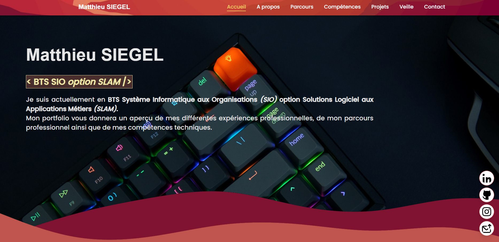

# Mon portfolio

Voici le portfolio développer pour mon année de BTS SIO option SLAM.    
Entièrement fait main, code and design by myself ! :smiley:

Langages de développement :    
|| ||
|-------|------|------|

Pour le voir il suffit de cliquer :point_right: [Portfolio Matthieu SIEGEL](https://imnotaowl.github.io/mon_portfolio/ "Portfolio Matthieu SIEGEL"):point_left:  
Ou aller sur Environments -> github-pages ci-contre :arrow_forward:
